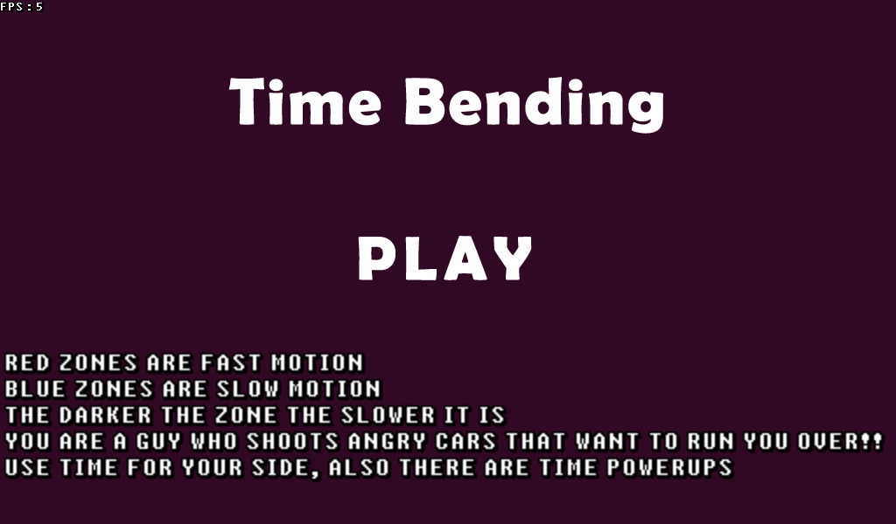

## Time Bending [Itch.io](https://wexdex.itch.io/time-bending)

#### Authors: 
> - **Kirito**: [itch.io](https://kirito0625.itch.io/ "itch.io"), [github](https://github.com/theVoidZ "github"), discord: Kirito#7331
> - **WexDex**: [itch.io](https://wexdex.itch.io/ "itch.io"), [github](https://github.com/WexDex "github"), discord: WexDex#7312

#### GameJam: [LÖVE Jam 2020 - FEQUENCY](https://itch.io/jam/love2d-jam-2020 "LÖVE Jam 2020 - FEQUENCY")

a Game made with [LÖVE 11.3](https://love2d.org/ "LÖVE 11.3") for the LÖVE Jam 2020.

You play as a guy who shoots cars in a land where time frequency is dissolved,
there are zones (BLUE) in which time runs slower and zones (RED) time runs faster the darker the color is the slower time it is.

you can collect the clock power up to stop time for a short time to try and kill all current enemies.

NOTE that the level periodically changes the zones

Controls:

- WASD - move

- Left click - shoot

Install :

- Extract then execute "play.bat" for Windows users or "make.sh" for Linux users

Screenshots:

