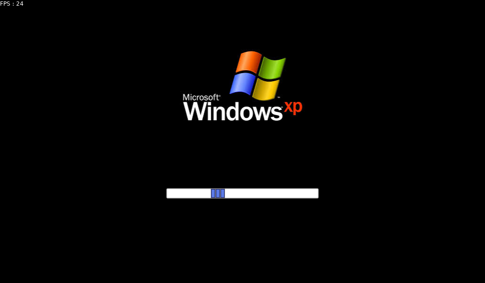
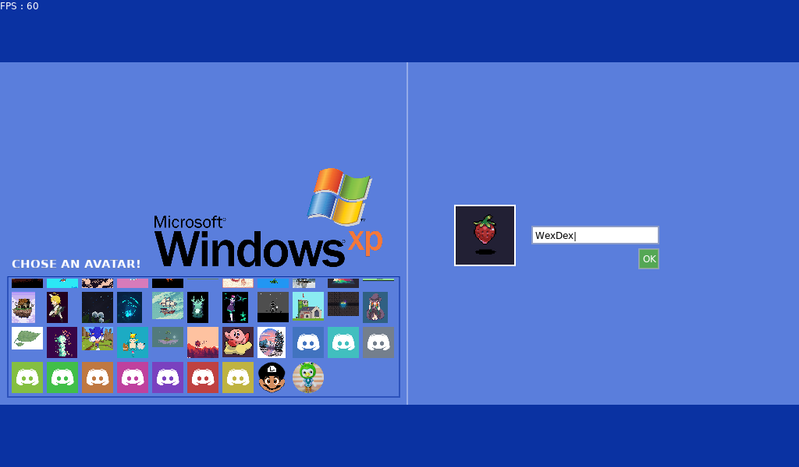
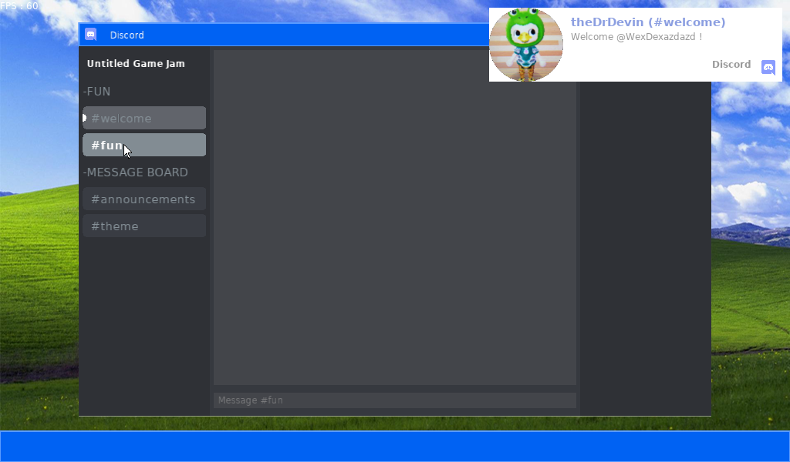

## Gravity Has Joined the Game [Itch.io](https://wexdex.itch.io/gravity-has-joined-the-game)

#### Authors: 
> - **Kirito**: [itch.io](https://kirito0625.itch.io/ "itch.io"), [github](https://github.com/theVoidZ "github"), discord: Kirito#7331
> - **WexDex**: [itch.io](https://wexdex.itch.io/ "itch.io"), [github](https://github.com/WexDex "github"), discord: WexDex#7312

#### GameJam: [Untitled Game Jam #18- Gravity](https://itch.io/jam/untitled-game-jam-18 "Untitled Game Jam #18 - Gravity")

a Game made with [LÖVE 11.3](https://love2d.org/ "LÖVE 11.3") for the UGJ#18.

you play in a windows xp and try to join the game jam and submit your game, but the theme gives you minigames to play.

unfortunatly i didn't have time to finish it :'(.

anyways have fun and thanks for playing.

Install :

- Extract then execute "play.bat" for Windows users or "make.sh" for Linux users

Screenshots:

